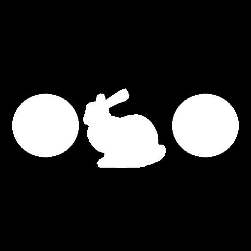

# CS636 - Advanced Rendering Techniques
## Assignment 1

All images use the following coordinate system:
- **X** left-right
- **Y** up-down
- **Z** in-out (of screen)

### Scene 1
A recreation of the assignment example scene.
It consists of two spheres at $(1.0, 0.0, 0.0)$ and $(-1.0, 0.0, 0.0)$, and the `bound-bunny_1k.smf` model at $(0.0, 0.0, 0.0)$.
The orientation of the bunny is different due to the different coordinate systems.

### Camera Parameters
Location | Direction | Up | Angle
-------- | --------- | -- | -----
$(0.0, 0.0, 3.0)$ | $(0.0, 0.0, -1.0)$ | $[0.0, 1.0, 0.0]$ | $56.0$