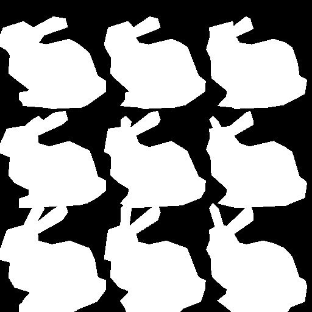
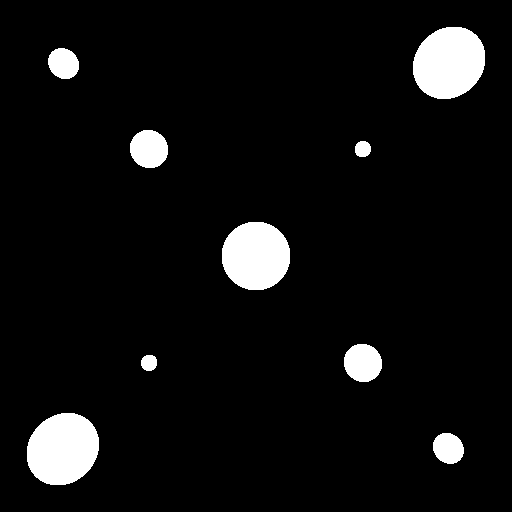
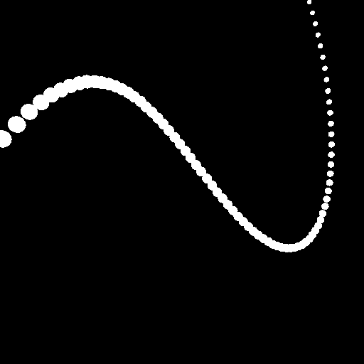
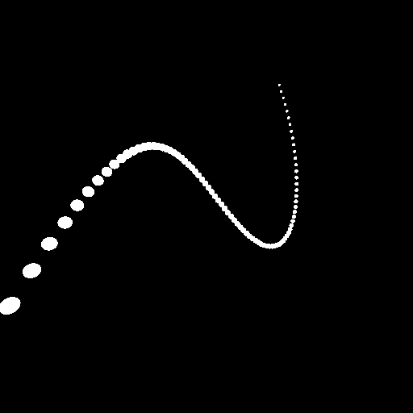
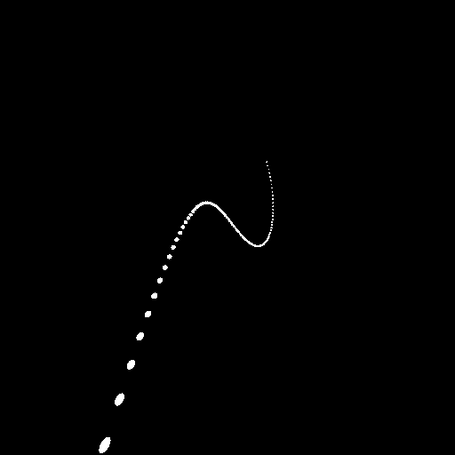
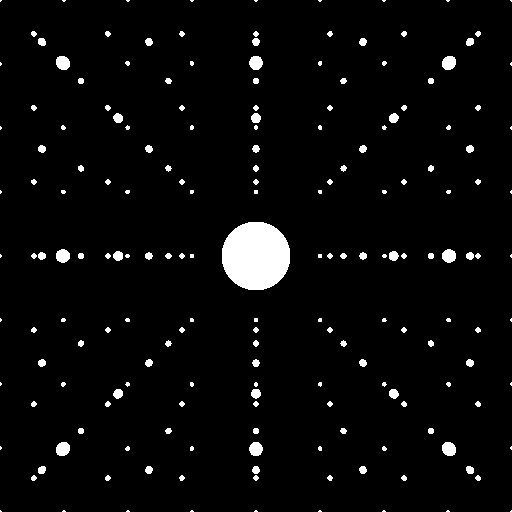
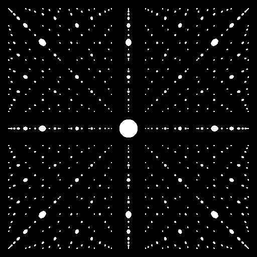
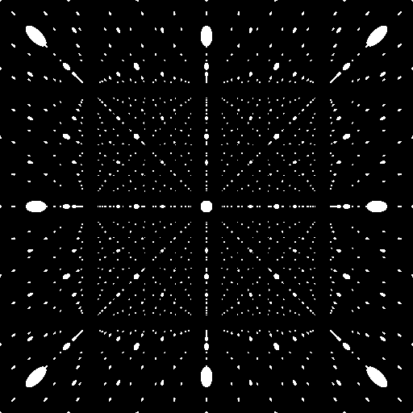

# CS636 - Advanced Rendering Techniques
## Assignment 1

## Configuration
All images use the following coordinate system:
- **X** left-right
- **Y** up-down
- **Z** in-out (of screen)

Camera configuration files are formatted as follows:
- **l** location vector
- **d** direction vector
- **u** up vector
- **a** viewing angle
- **h** horizontal resolution
- **v** vertical resolution

Scene configuration files are formatted as follows:
- **m** number of mesh models
  - followed by a model file path and location vector, for each model
- **p** number of parametric models (only spheres for now)
  - followed by a type, radius, and location vector, for each model

## Images

### Bunny
Recreation of the assignment example image (with a different orientation due to coordinate systems).
The first image shows `bound-bunny_1k.smf` and the second shows `bound-bunny_200.smf`. 

images/scene_bunny.png | images/scene_bunnygrid.png
--- | ---
 | 

Scene | Camera | Ray Intersect Time (`s`)
------ | ----- | ------------------
`config/scene_bunny.txt` | `config/camera-003-56-512.txt` | `13.154582`
`config/scene_bunnygrid.txt` | `config/camera-003-56-512.txt` | `24.454069`

### Sphere Cube
Different sized spheres arranged in a cube.

images/scene_spherecube56.png | images/scene_spherecube90.png
--- | ---
 | 

Scene | Camera | Ray Intersect Time
------ | ----- | ------------------
`config/scene_spherecube.txt` | `config/camera-007-56-512.txt` | `0.052294`
`config/scene_spherecube.txt` | `config/camera-007-90-512.txt` | `0.075021`

### Sphere Bezier Curve
Spheres arranged in a bezier-curve.
Scene generated by a script.

images/scene_spherebezier56.png | images/scene_spherebezier90.png | images/scene_spherebezier120.png
--- | --- | ---
 |  | 

Scene | Camera | Ray Intersect Time
------ | ----- | ------------------
`config/scene_spherebezier.txt` | `config/camera-007-56-512.txt` | `0.541690`
`config/scene_spherebezier.txt` | `config/camera-007-90-512.txt` | `0.545998`
`config/scene_spherebezier.txt` | `config/camera-010-120-512.txt` | `0.525959`

### Sphere Grid
Spheres arranged in a large grid.
Scene generated by a script.

images/scene_spheregrid56.png | images/scene_spheregrid90.png | images/scene_spheregrid120.png
--- | --- | ---
 |  | 

Scene | Camera | Ray Intersect Time
------ | ----- | ------------------
`config/scene_spheregrid.txt` | `config/camera-007-56-512.txt` | `17.403652`
`config/scene_spheregrid.txt` | `config/camera-007-90-512.txt` | `18.383661`
`config/scene_spheregrid.txt` | `config/camera-010-120-512.txt` | `18.214960`
