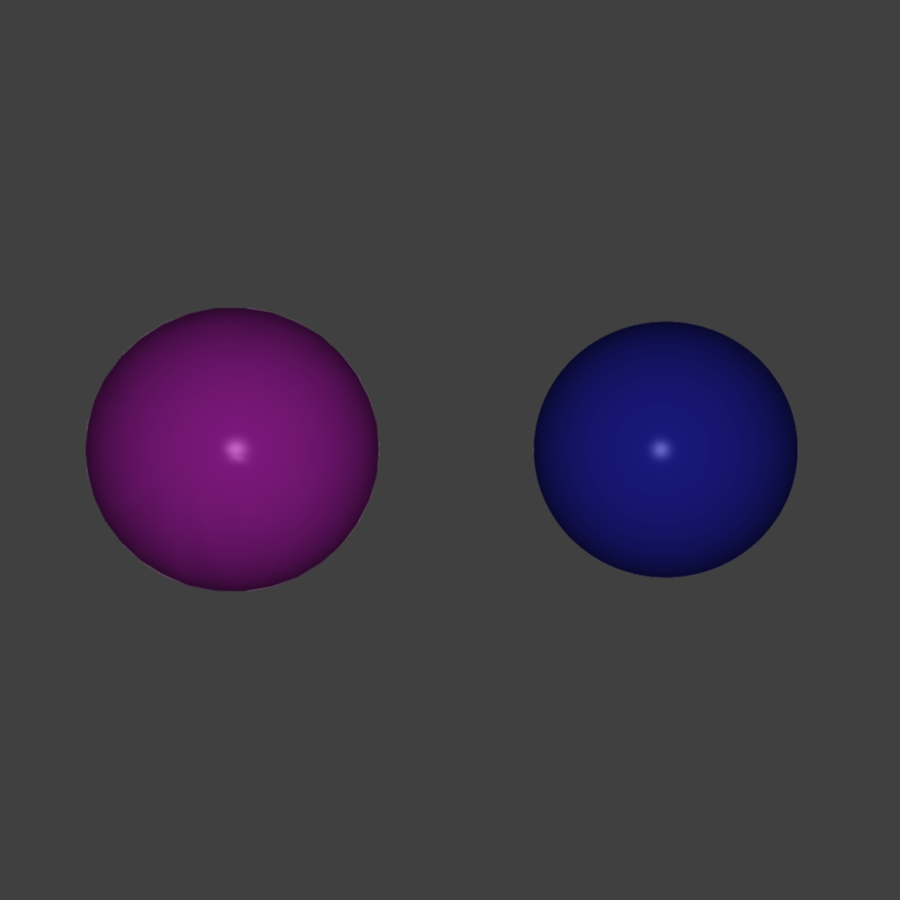
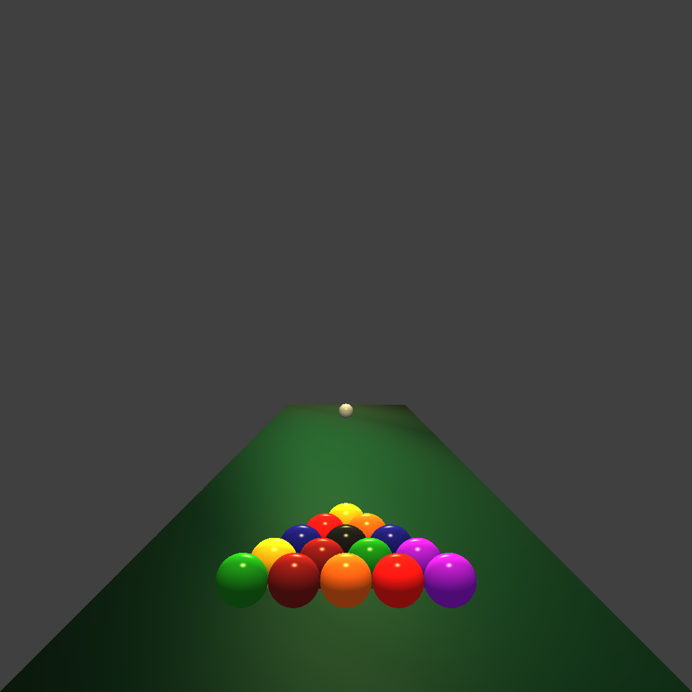

# CS636 - Advanced Rendering Techniques
## Assignment 2

## Configuration
All images use the following coordinate system:
- **X** left-right
- **Y** up-down
- **Z** in-out (of screen)

Camera configuration files are formatted as follows:
- **l** location vector
- **d** direction vector
- **u** up vector
- **a** viewing angle
- **h** horizontal resolution
- **v** vertical resolution

Scene configuration files are formatted as follows:
- number of lights
    - ambient light value
    - followed by a list of:
        - type (not used currently)
        - intensity
        - location
- number of objects
    - followed by a list of:
        - type (0 = mesh model, 1 = sphere)
        - model file path or sphere radius
        - diffuse coefficient
        - spectral coefficient
        - ambient coefficient
        - shininess factor
        - color
        - location

## Images
All images are `1024x1024` resolution.
When anti-aliasing is enabled, a `2048x2048` image is calculated and down-sampled to `1024x1024`.
An anti-aliased version of each image is shown on the right.

### Spheres
This scene contains the `bound-lo-sphere.smf` model at `-0.75 0.0 0.0` and a sphere of with radius `0.45` at `0.75 0.0 0.0`
There is a single light with intensity `1.0 1.0 1.0` placed at the location of the camera at `0.0 0.0 3.0`.
The ambient light value is `0.25 0.25 0.25`
Both objects have the following shading parameters:
| **Diffuse** | **Spectral** | **Ambient** | **Shininess** |
|-------------|--------------|-------------|---------------|
|     0.7     |      0.3     |     1.0     |      100      |

images/scene_spheres.png | images/scene_spheres_aa.png
--- | ---
 | 

Scene | Camera | Ray Intersect Time
------ | ----- | ------------------
`config/scene_spheres.txt` | `config/camera-003-56-1024.txt` | `83.936607`
`config/scene_spheres.txt` | `config/camera-003-56-1024.txt` | `465.097107`

### Pool
This scene contains `16` spheres set up as billiards balls racked up on a crude pool table.
There are two lights with intensity `1.0 0.9 0.5` set up at each end of the "table".
The spheres have the following shading parameters:
| **Diffuse** | **Spectral** | **Ambient** | **Shininess** |
|-------------|--------------|-------------|---------------|
|     1.0     |      1.0     |     1.0     |      100      |

The `rect.smf` model used as the table (which is just `cube.smf` when some vertices moved) has the following parameters:
| **Diffuse** | **Spectral** | **Ambient** | **Shininess** |
|-------------|--------------|-------------|---------------|
|     0.7     |      0.1     |     0.1     |       2       |

images/scene_pool.png | images/scene_pool_aa.png
--- | ---
 | 

Scene | Camera | Ray Intersect Time
------ | ----- | ------------------
`config/scene_pool.txt` | `config/camera-003-56-1024.txt` | `1.491602`
`config/scene_pool.txt` | `config/camera-003-56-1024.txt` | `6.286048`

### Sphere Grid
This scene shows `9` spheres and `9` lights in a grid pattern.
Each light is positioned in front of a sphere, `0.5` in the z-axis.
Each light has an intensity that is slighty lower than the color of the sphere it is in front of.
From left to right, the shading parameters of each sphere go from `1.0` to `0.5`, then to `0.25`.
All spheres have a shininess factor of `15`.

images/scene_spheregrid.png | images/scene_spheregrid_aa.png
--- | ---
 | 

Scene | Camera | Ray Intersect Time
------ | ----- | ------------------
`config/scene_spheregrid.txt` | `config/camera-003-56-1024.txt` | `1.201748`
`config/scene_spheregrid.txt` | `config/camera-003-56-1024.txt` | `1.791008`

### Smile
This scene shows `2` mesh models and `10` spheres with `3` lights.
The models are `bound-lo-sphere.smf` at `-0.75 0.8 0.0` and `bound-bunny_1k.smf` at `0.75 0.8 0.0`.
There is a red light in front of the blue ball, and a blue light in front of the red bunny (`2.0` in the z-axis for both).
There is a light with intensity `1.0 1.0 1.0` located at `0.0 0.0 0.0`.
The spheres form a curve and have a shininess factor linearly interpolated between `5` and `50` along it.
They have the following shading parameters:
| **Diffuse** | **Spectral** | **Ambient** |
|-------------|--------------|-------------|
|     0.3     |      0.7     |     0.1     |

The other objects have the following shading parameters:
| **Diffuse** | **Spectral** | **Ambient** | **Shininess** |
|-------------|--------------|-------------|---------------|
|     1.0     |      1.0     |     1.0     |      100      |

images/scene_smile.png | images/scene_smile_aa.png
--- | ---
 | 

Scene | Camera | Ray Intersect Time
------ | ----- | ------------------
`config/scene_smile.txt` | `config/camera-003-56-1024.txt` | `184.932983`
`config/scene_smile.txt` | `config/camera-003-56-1024.txt` | `898.221802`