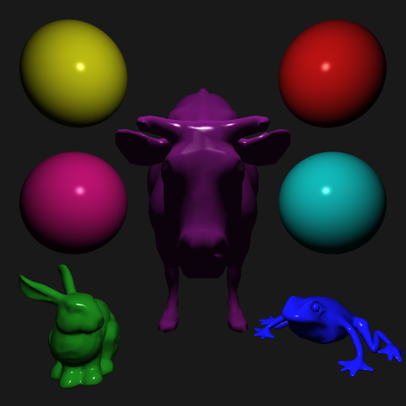
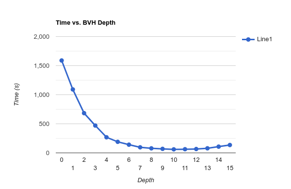
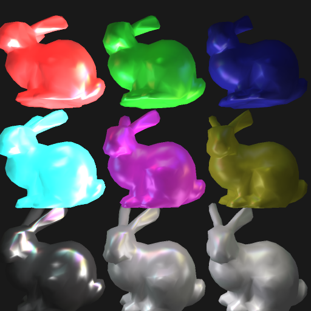
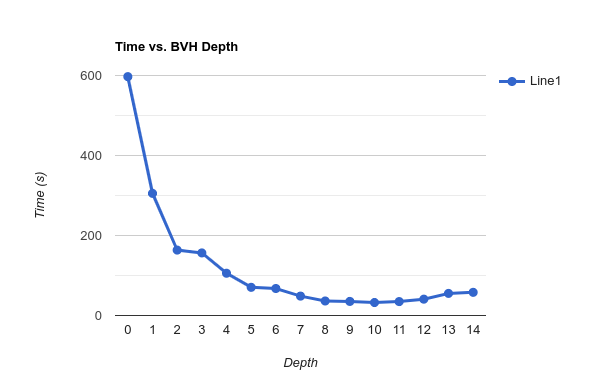
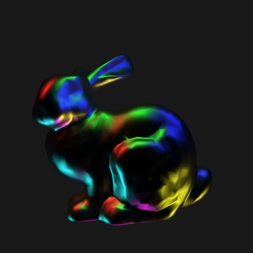
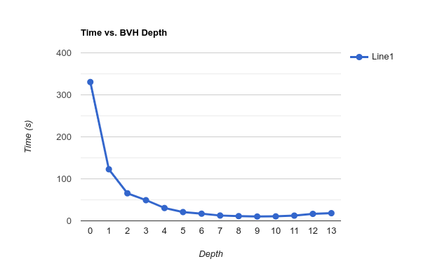

# CS636 - Advanced Rendering Techniques
## Assignment 3

## Configuration
All images use the following coordinate system:
- **X** left-right
- **Y** up-down
- **Z** in-out (of screen)

Camera configuration files are formatted as follows:
- **l** location vector
- **d** direction vector
- **u** up vector
- **a** viewing angle
- **h** horizontal resolution
- **v** vertical resolution

Scene configuration files are formatted as follows:
- number of lights
    - ambient light value
    - followed by a list of:
        - type (not used currently)
        - intensity
        - location
- number of objects
    - followed by a list of:
        - type (0 = mesh model, 1 = sphere)
        - model file path or sphere radius
        - diffuse coefficient
        - spectral coefficient
        - ambient coefficient
        - shininess factor
        - color
        - location
        - rotation
        - scale

## Images
All images are `512x512` resolution after down-sampling from `1024x1024`.

## Bounded Volume Hierarchy
I implemented a Bounded Volume Hierarchy as the acceleration data structure.
All mesh-model objects in a scene are divided into a set of triangle objects prior to being placed into the hierarchy.
The tree has a tuneable depth parameter that cuts off tree construction when at a certain depth, or a single object is left.
It also accepts `-1` as a value, which will calculate the depth required to place each individual object at a leaf.

### BVH Test
- `24928` objects
- `bound-cow.smf`
- `bound-bunny_5k.smf`
- `frog.smf`
- `4` spheres
- `1` white light

images/scene_bvhtest0.png | images/scene_bvhtest10.png
--- | ---
 | 
`1589.226929s` | `60.878895s`

### Bunny Grid
- `9000` objects
- `bound-bunny_1k.smf`
- `9` lights

images/scene_bunnygrid0.png | images/scene_bunnygrid10.png
--- | ---
 | 
`597.164978s` | `32.427299s`

### Bunny
- `5000` objects
- `bound-bunny_5k.smf`
- `9` lights

images/scene_bunny0.png | images/scene_bunny9.png
--- | ---
 | 
`330.499207s` | `10.303057s`

