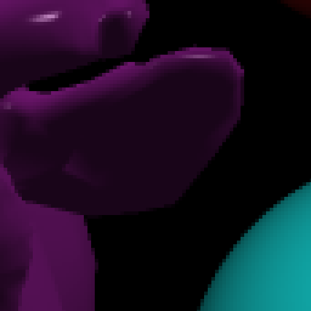

# CS636 - Advanced Rendering Techniques
## Assignment 4

## Images

### No AA
images/none-pixels.png | images/none-pixels-zoom.png
--- | ---
 | 
`17.360275s` | `262144` primary rays

### Uniform AA
images/uniform-aa.png | images/uniform-aa-zoom.png
--- | ---
 | 
`66.353943` | `1048576` primary rays

### Adaptive AA
Tolerance set to `0.05`.

images/adaptive-aa.png | images/adaptive-aa-zoom.png
--- | ---
 | 
`33.715668s` | `582320` primary rays

### Ray Density
images/density1.png | images/density05.png | images/density025.png
--- | --- | ---
 |  | 
`0.1` tolerance | `0.05` tolerance | `0.025` tolerance
