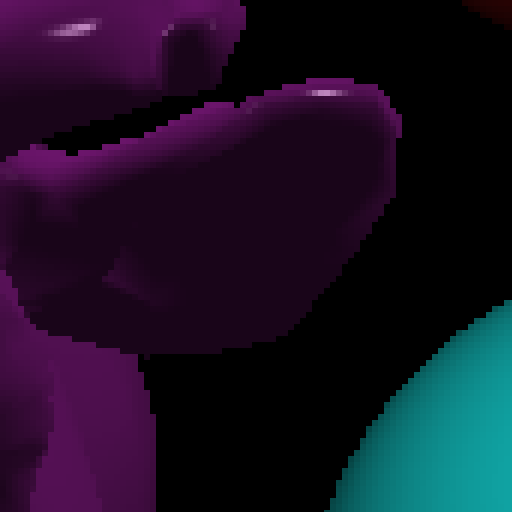

# CS636 - Advanced Rendering Techniques
## Assignment 4

## Images
images/none-pixels.png | images/none-pixels-zoom.png
--- | ---
 | 
`16.938049s` | `262144` primary rays

images/uniform-aa.png | images/uniform-aa-zoom.png
--- | ---
 | 
`66.215736` | `1048576` primary rays

images/adaptive-aa.png | images/adaptive-aa-zoom.png
--- | ---
 | 
`33.682646s` | `582320` primary rays

images/density1.png | images/density05.png | images/density01.png
--- | --- | ---
 |  | 