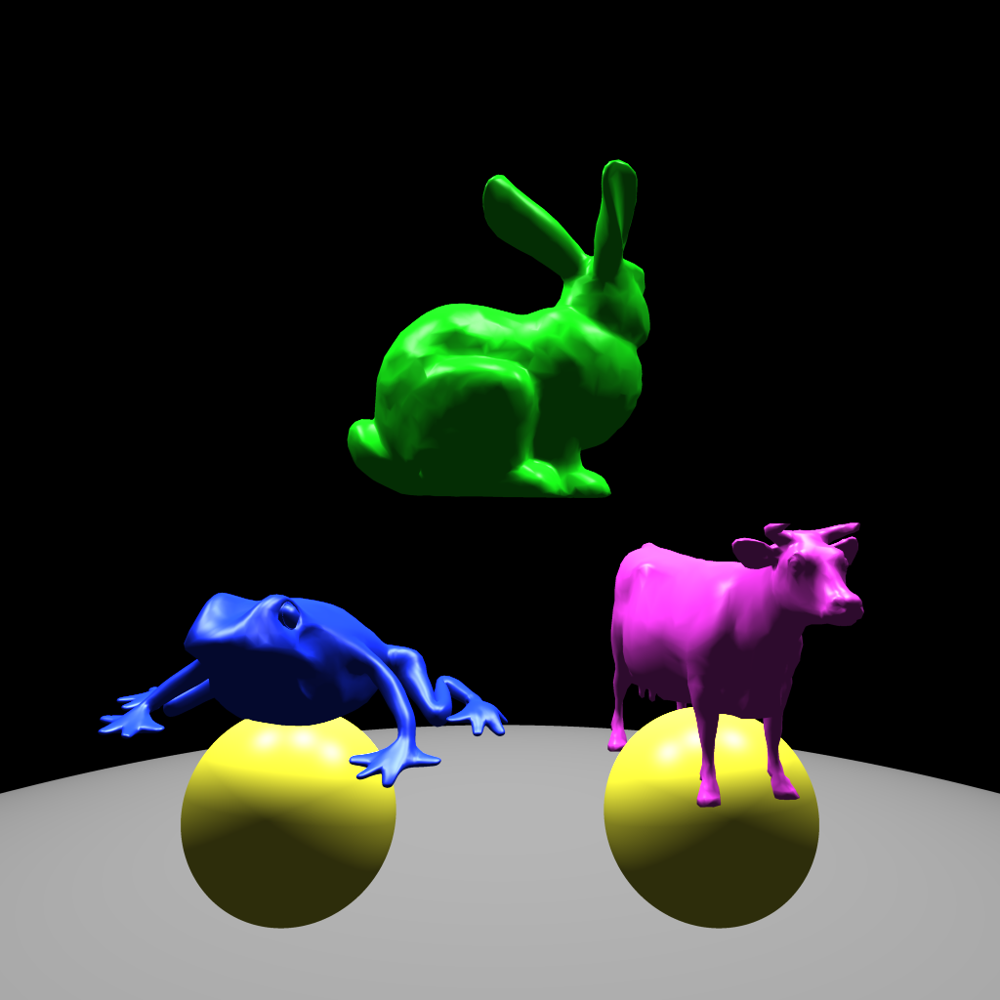
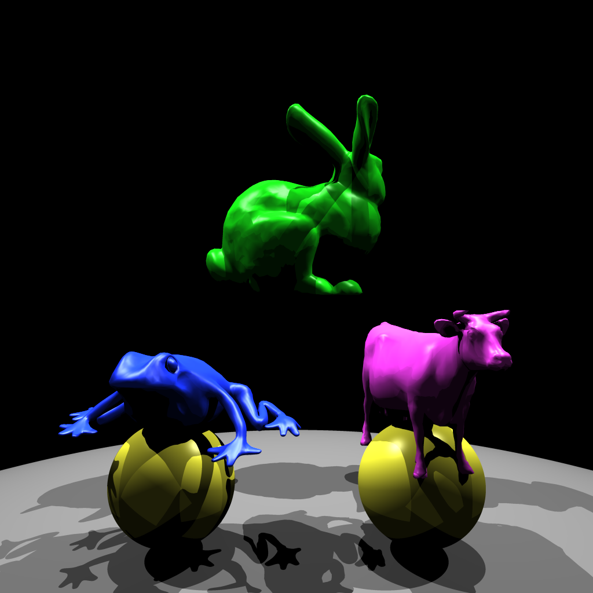

# CS636 - Advanced Rendering Techniques
## Assignment 5

## Images

### No Shadows

| images/test_noshadow.png |
| --- |
|  |
| `154.497075s` |

### Yes Shadows

| images/test_shadow.png |
| --- |
|  |
| `243.730019s` |

### Scene

#### Lights
position | intensity
-------- | ---------
`-2.0 3.0 0.0` | `0.75 0.75 0.75`
`0.0 3.0 0.0` | `0.75 0.75 0.75`
`2.0 3.0 0.0` | `0.75 0.75 0.75`

#### Objects
type | diffuse (color) | spectral (color) | ambient (color)
---- | ------- | -------- | -------
`sphere r = 10.0` | `1.0 (0.25 0.25 0.25)` | `0.0 (1.0 1.0 1.0)` | `1.0 (0.25 0.25 0.25)`
`bound-bunny_5k`  | `1.0 (0.1 0.98 0.1)`   | `0.7 (1.0 1.0 1.0)` | `0.3 (0.2 0.2 0.2)`
`bound-cow`       | `1.0 (0.99 0.25 0.98)` | `0.7 (1.0 1.0 1.0)` | `0.3 (0.2 0.2 0.2)`
`frog`            | `1.0 (0.1 0.2 0.99)`   | `0.7 (1.0 1.0 1.0)` | `0.3 (0.2 0.2 0.2)`
`sphere r = 0.25` | `1.0 (0.99 0.98 0.25)` | `0.7 (1.0 1.0 1.0)` | `0.3 (0.2 0.2 0.2)`
`sphere r = 0.25` | `1.0 (0.99 0.98 0.25)` | `0.7 (1.0 1.0 1.0)` | `0.3 (0.2 0.2 0.2)`