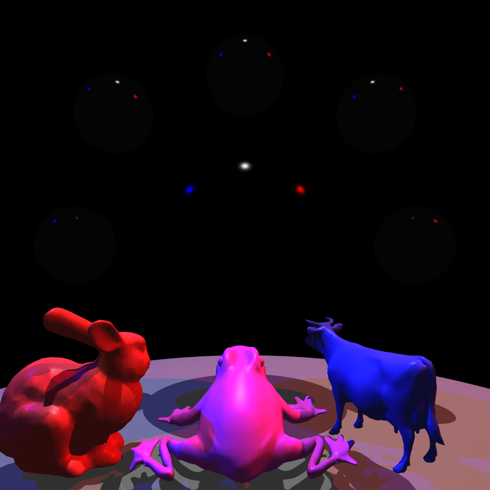
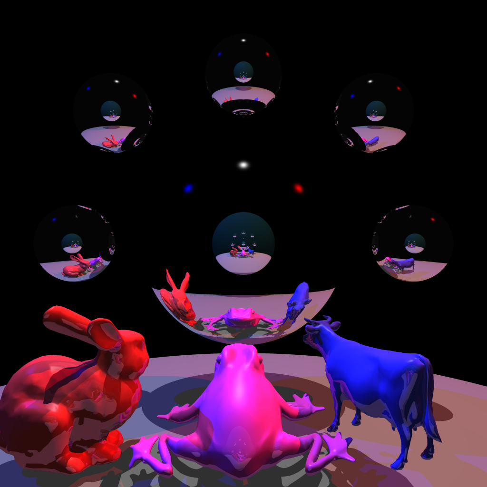

# CS636 - Advanced Rendering Techniques
## Assignment 6

## Images

### No Reflections

| images/test_noreflection.png |
| --- |
|  |
| `257.204758s` |

### Yes Reflections
Reflection depth limit is set to `5`.

| images/test_reflection.png |
| --- |
|  |
| `466.903877s` |

### Scene

#### Lights
position | intensity
-------- | ---------
`0.0 10.0 0.0` | `1.0 1.0 1.0`
`-10.0 10.0 0.0` | `0.0 0.0 1.0`
`10.0 10.0 0.0` | `1.0 0.0 0.0`

#### Objects
type | diffuse (color) | spectral (color) | ambient (color) | reflection coefficient
---- | ------- | -------- | ------- | -------
`sphere r = 10.0` | `1.0 (0.25 0.25 0.25)` | `0.0 (1.0 1.0 1.0)` | `1.0 (0.25 0.25 0.25)` | `0.0`
`sphere r = 0.65` | `0.0 (1.0 1.0 1.0)`    | `1.0 (1.0 1.0 1.0)` | `0.0 (0.2 0.2 0.2)`    | `1.0`
`sphere r = 1.0`  | `0.1 (0.25 1.0 1.0)`   | `1.0 (1.0 1.0 1.0)` | `0.1 (0.2 0.2 0.2)`    | `1.0`
`bound-bunny_5k`  | `0.7 (0.99 0.25 0.25)` | `0.3 (1.0 1.0 1.0)` | `0.3 (0.2 0.2 0.2)`    | `0.25`
`bound-cow`       | `0.7 (0.24 0.25 0.98)` | `0.3 (1.0 1.0 1.0)` | `0.3 (0.2 0.2 0.2)`    | `0.25`
`frog`            | `0.7 (0.99 0.25 0.98)` | `0.3 (1.0 1.0 1.0)` | `0.3 (0.2 0.2 0.2)`    | `0.25`
`sphere r = 0.25 (x5)` | `0.0 (0.1 0.1 0.1)`    | `1.0 (1.0 1.0 1.0)` | `0.3 (0.2 0.2 0.2)`    | `1.0`