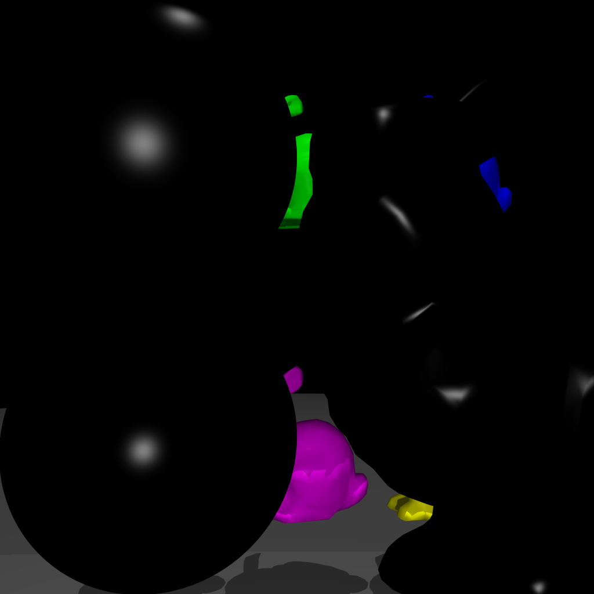
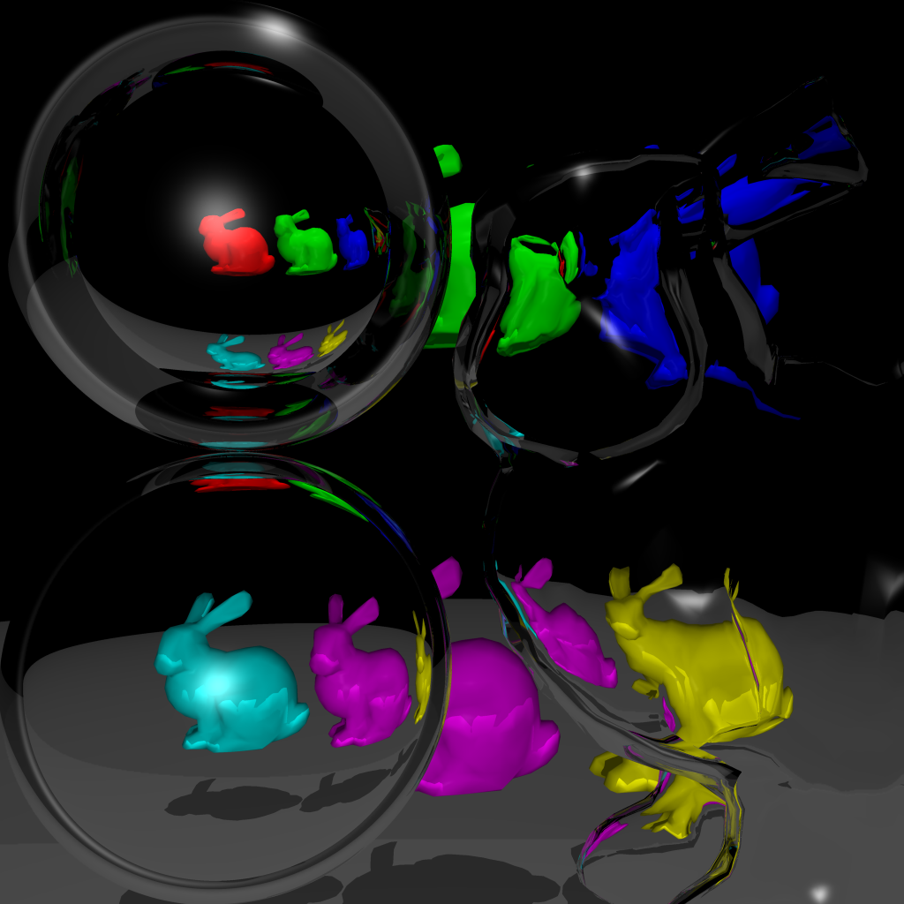

# CS636 - Advanced Rendering Techniques
## Assignment 7

## Images

### No Refraction

| images/test_norefraction.png |
| --- |
|  |
| `71.611031s` |

### Yes Refraction

| images/test_refraction.png |
| --- |
|  |
| `637.489563s` |

### Scene

#### Lights
position | intensity
-------- | ---------
`0.0 0.0 5.0` | `0.5 0.5 0.5`
`0.0 5.0 0.0` | `0.5 0.5 0.5`

#### Refractive Objects
type | diffuse (color) | spectral (color) | ambient (color) | refractive index
---- | ------- | -------- | ------- | -------
`sphere r = 0.25 (top)`    | `0.0` | `1.0 (1.0 1.0 1.0)` | `0.0` | `1.4`
`sphere r = 0.25 (bottom)` | `0.0` | `1.0 (1.0 1.0 1.0)` | `0.0` | `1.1`
`bound-bunny_5k`           | `0.0` | `1.0 (1.0 1.0 1.0)` | `0.0` | `1.1`