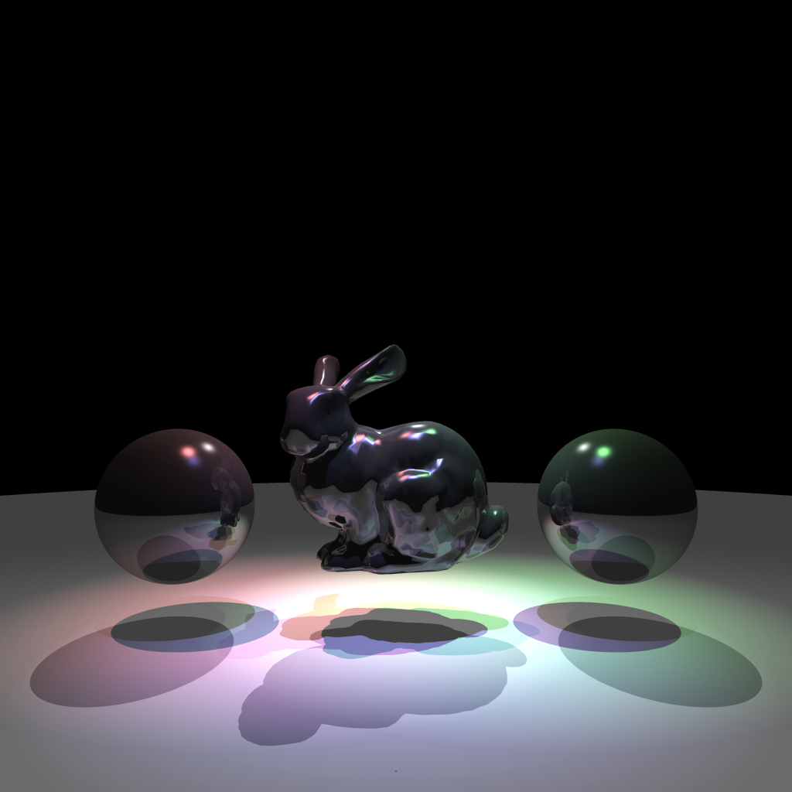

# CS636 - Advanced Rendering Techniques
## Assignment 7

## Images

### Spotlights

| images/test_spotlight.png |
| --- |
|  |

### Scene

#### Lights
All lights are spotlights

position | color | direction | angle | cutoff
-------- | --------- | --- | --- | ---
`-0.5 2.0 -0.5` | `1.0 0.0 0.0` | `0.0 -1.0 0.0`           | `25.0` | `1`
`0.5 2.0 -0.5`  | `0.0 1.0 0.0` | `0.0 -1.0 0.0`           | `25.0` | `1`
`0.0 2.0 0.0`   | `0.0 0.0 1.0` | `0.0 -1.0 0.0`           | `25.0` | `1`
`0.0 2.0 -2.0`  | `0.1 0.1 0.1` | `0.0 -0.707107 0.707107` | `65.0` | `2`